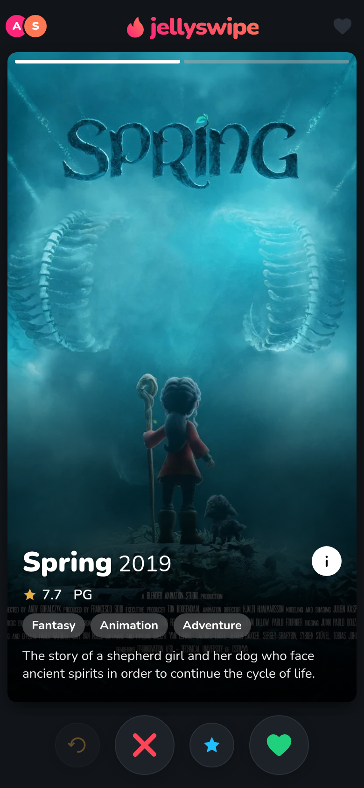
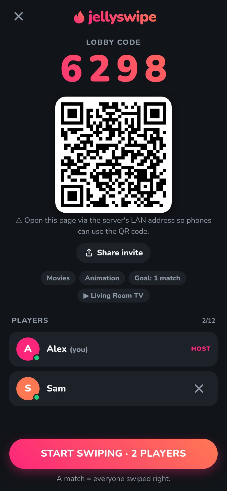
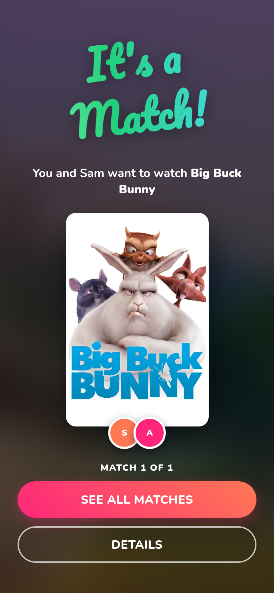
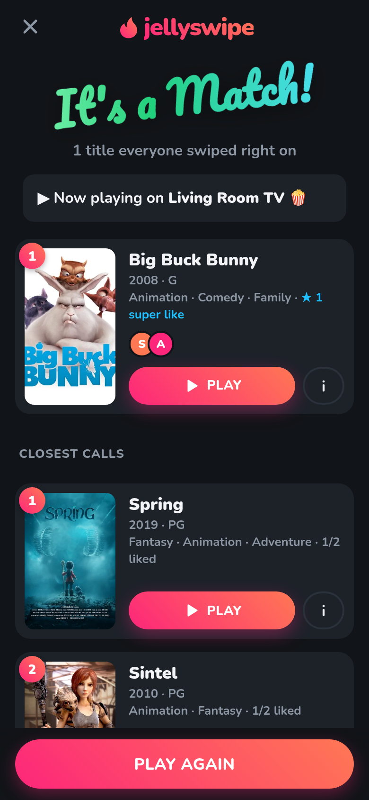

# JellySwipe 🔥

**Tinder for your Jellyfin library, as a native Jellyfin plugin.** Pick libraries and genres, open a lobby, and everyone swipes on their phone. The first titles *everyone* swiped right on win, and JellySwipe can start the winner on your TV automatically.

- 🃏 Tinder-style cards: drag with rotation, LIKE / NOPE / SUPER LIKE stamps, tap to flip poster ↔ backdrops, rewind, "It's a Match!" celebration
- 👥 Lobbies with a **4-digit code + QR code**. Nobody needs to log in: guests just type a name, and hosts without a Jellyfin session host as a user you pick.
- 🎯 Goal of **1, 3 or 5 matches**. Solo mode turns right-swipes into your personal picks.
- 📺 **Play on any Jellyfin device** you can control (Android TV, web, mobile…). Series start at the first unwatched episode and keep going.
- ⏱ Optional **auto-play of the winner** with a cancellable countdown
- 🧭 **Sidebar entry + header button** in Jellyfin web (via the [File Transformation](https://github.com/IAmParadox27/jellyfin-plugin-file-transformation) plugin, optional)
- 📱 Mobile-first PWA, dark mode, haptics. Also works on desktop: ← → ↑ keys, Z to undo, Space for details.

Runs entirely inside Jellyfin at `https://<your-jellyfin>/JellySwipe/`, with no extra server or container. See [IDEA.md](IDEA.md) for the original idea and design decisions.

▶ **Watch the demo:** [YouTube (1:17)](https://youtu.be/shTgXxoehIY) · [Short](https://youtube.com/shorts/Mt-CdXJU56Y)

<p align="center">
  
  
  
  
</p>

## Compatibility

| Jellyfin | Plugin build | Tested on | Sidebar entry |
|---|---|---|---|
| 10.9.x | `0.2.0.109` (.NET 8) | 10.9.11 | open `/JellySwipe/` directly (File Transformation isn't available for 10.9) |
| 10.10.x | `0.2.0.1010` (.NET 8) | 10.10.7 | ✅ with File Transformation 2.5.x |
| 10.11.x | `0.2.0.1011` (.NET 9) | 10.11.0, 10.11.11 | ✅ with a File Transformation build matching your server |
| 12.x | `0.2.0.1200` (.NET 10) | 12.0, 12.1 | ✅ (new MUI layout supported) |

The plugin catalog installs the right build automatically. Each release is runtime-tested against real Jellyfin containers with `dev/test-matrix.sh`.

It plays nicely with other plugins: it only adds its own `/JellySwipe` routes, ships no shared DLLs, and hooks into the web client through File Transformation's shared `index.html` pipeline. That's verified alongside Media Bar, Jellyfin Enhanced, JavaScript Injector, Intro Skipper and JellyTag. Without File Transformation you can still add the sidebar entry with the **JavaScript Injector** plugin:

```js
const s = document.createElement('script'); s.src = '../JellySwipe/inject.js'; document.head.appendChild(s);
```

## Install

### From the plugin repository

1. Jellyfin Dashboard → **Plugins → Repositories → +**
   - Name: `JellySwipe`
   - URL: `https://raw.githubusercontent.com/marceljhuber/jellyswipe/main/manifest.json`
2. **Catalog → JellySwipe → Install**, then restart Jellyfin. The catalog picks the build for your Jellyfin version.
3. Optional, for the sidebar entry: also install **File Transformation** from `https://www.iamparadox.dev/jellyfin/plugins/manifest.json`.

### Manually

Download the zip for your Jellyfin version from the [releases](https://github.com/marceljhuber/jellyswipe/releases) (`jellyswipe_0.2.0.<109|1010|1011|1200>.zip`, see the table above) and extract the DLL into the Jellyfin config's plugin folder, e.g.

```bash
mkdir -p /config/plugins/JellySwipe_0.2.0.1011
unzip jellyswipe_0.2.0.1011.zip -d /config/plugins/JellySwipe_0.2.0.1011
# then restart Jellyfin
```

## Use it

- **Open:** the flame button in Jellyfin's header, **JellySwipe** in the sidebar, or `https://<your-jellyfin>/JellySwipe/`.
- **Host:** no login needed. If you're signed in to Jellyfin in that browser, you host as yourself. Otherwise you host as the *default host user* from the plugin settings (by default the first administrator).
- **Guests:** scan the lobby QR code or open `/JellySwipe/` and type the 4-digit code. "Share invite" copies the link, even on plain-http LAN setups, and opens the phone's share sheet where available.
- **Play:** tap ▶ on any result and pick a device, or choose an auto-play device when creating the game. Devices appear while a Jellyfin app is open on them.

### Settings (Dashboard → Plugins → JellySwipe)

| Setting | Default |
|---|---|
| Allow guests without a Jellyfin account | on |
| Allow hosting without signing in | on |
| Host games as (for people not signed in) | first administrator |
| Show JellySwipe in the sidebar (needs File Transformation) | on |
| Auto-play countdown | 10 s |
| Maximum cards per game | 400 |

## How a game works

1. **Create:** pick libraries (movies / shows / collections / home videos), optional genres, the match goal, "only unwatched", and optionally an auto-play device.
2. **Lobby:** friends join by QR code or lobby code. With one player the host's button says *Play solo*.
3. **Swipe:** everyone gets the **same set of cards, each in their own random order**. A match is a title every player in the lobby liked or super-liked.
4. **Finish:** when the goal is reached, everyone sees the celebration and the ranked results (super-likes rank first, then match order). If the deck runs out first, you get the matches so far plus the *closest calls*.

## Architecture

```
Jellyfin.Plugin.JellySwipe/
  Plugin.cs                    plugin entry + dashboard settings page
  PluginServiceRegistrator.cs  DI registrations
  SidebarInjector.cs           registers an index.html transformation with File Transformation (reflection, optional)
  Api/JellySwipeController.cs  /JellySwipe/ (embedded web app) and /JellySwipe/api/* (REST + Server-Sent Events)
  Game/LibraryService.cs       libraries, genres, deck, controllable sessions, playback (Jellyfin internals, no HTTP)
  Game/RoomManager.cs          in-memory lobbies, swipes, match detection, auto-play timer
  Web/                         vanilla JS SPA, Tinder-style CSS, QR generator, sidebar inject.js
dev/smoke-test.py              end-to-end API test against any Jellyfin with the plugin installed
```

- **Auth:** if Jellyfin web is signed in on the same origin, its token is sent along and validated through `IAuthorizationContext`. Otherwise the configured default host user is used. Guests are identified only by a random per-lobby secret.
- **Realtime:** Server-Sent Events plus plain POSTs. A reload resumes at the same card.
- **Images** come straight from Jellyfin's image API.
- Lobbies live in memory and expire after 6 hours of inactivity. A Jellyfin restart ends running games.

## Security notes

By default anyone who can reach JellySwipe can host games as the default host user, including playing on that user's devices. If your Jellyfin is reachable from outside your home, turn off *Allow hosting without signing in*, or pick a restricted user as the default host. A game only deals titles from libraries the host user can access. Anyone who can reach your Jellyfin URL can open `/JellySwipe/` and join a lobby if they know its code (unless guests are disabled). Players in a lobby can send "play" for **results of that lobby** to devices the host is allowed to control.

## Development

```bash
# build one variant (needs the matching .NET SDK: 8 for 10.9/10.10, 9 for 10.11, 10 for 12)
dotnet build Jellyfin.Plugin.JellySwipe -c Release -p:JellyfinTarget=10.11     # 10.9 | 10.10 | 10.11 | 12

# demo Jellyfin with the plugin + an open-licensed demo library (admin / test)
dev/demo-server.sh 12.1            # → http://localhost:28296/JellySwipe/

# runtime compatibility matrix (Docker): 10.9.11, 10.10.7, 10.11.0, 10.11.11, 12.0, 12.1
dev/test-matrix.sh

# API smoke test against any server
JF_URL=http://localhost:8096 JF_USER=admin JF_PASS=... python3 dev/smoke-test.py

# release: all variants + manifest entries
./scripts/package.sh               # or push a v* tag and let GitHub Actions publish the release
```


## License

MIT
